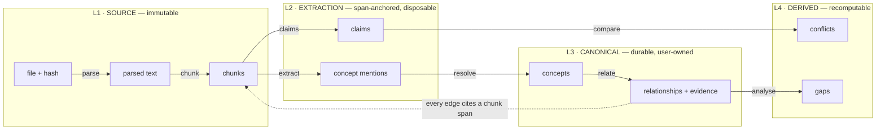
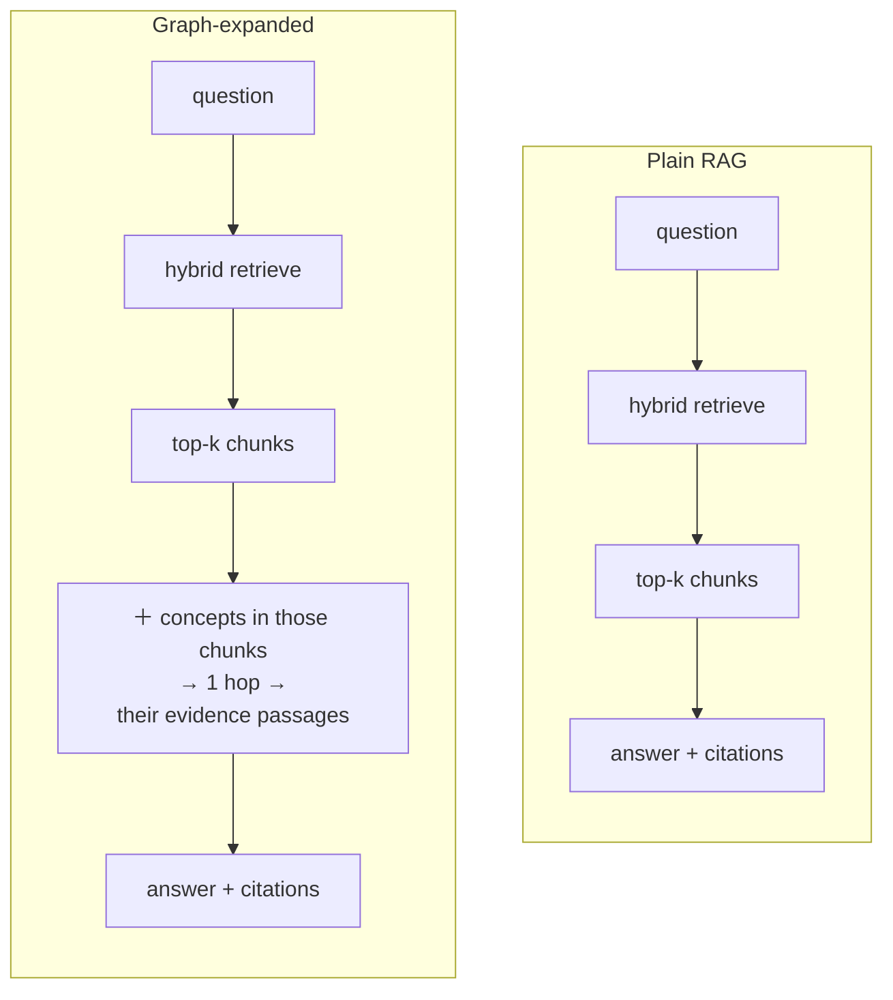
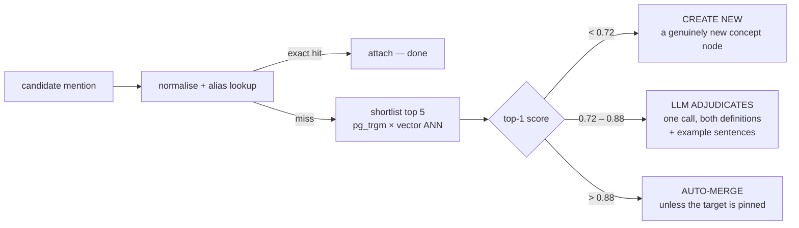

# Second Brain — Architecture

An AI system that builds and maintains a structured model of what one person knows —
built from their own documents, with every derived edge traceable back to the passage
that justified it.

> **Status:** decisions finalised; Phase 0 and Phase 1 (ingestion & storage) built.
> **Date:** 14 September 2026
> **Decision record:** see [§11](#11--decision-record) for the answers that shaped this
> document. Where this file and a later phase disagree, update this file — it is the
> baseline.

**Environment as inspected**

| Item | State |
| --- | --- |
| `C:\Projects\second-brain` | git repository (initialised in Phase 0) |
| Python | 3.13.5 ✓ |
| Git | 2.50.1 ✓ |
| Node | 24.19 ✓ |
| PostgreSQL | 17.11 native Windows service (`postgresql-x64-17`) + pgvector 0.8.6 built from source ✓ |
| Visual Studio Build Tools 2022 | C++ workload ✓ (only used to compile pgvector) |
| Docker | CLI installed but unusable: hardware virtualisation is disabled and will stay so. Not required. |

---

## Contents

0. [Product scope](#0--product-scope)
1. [System architecture](#1--system-architecture)
2. [Directory structure](#2--directory-structure)
3. [Database schema](#3--database-schema)
4. [API structure](#4--api-structure)
5. [Data flow](#5--data-flow)
6. [Document-processing pipeline](#6--document-processing-pipeline)
7. [Embedding & search architecture](#7--embedding--search-architecture)
8. [Knowledge-graph architecture](#8--knowledge-graph-architecture)
9. [Knowledge gaps & conflicts](#9--knowledge-gaps--conflicts)
10. [Development phases](#10--development-phases)
11. [Decision record](#11--decision-record)

---

## 0 — Product scope

### One person's knowledge, modelled — not a wiki, not a SaaS

Second Brain is a **local-first, single-user** application. It ingests what one person
has read and watched, extracts the concepts in it, discovers how those concepts relate,
keeps that graph current as new material arrives, and answers questions from it with
citations. It is not a public product, not multi-tenant, and not a social or community
knowledge platform. Every design choice below assumes one user on one machine.

**Sources** (in scope): PDF — textbooks, papers, lecture slides · Markdown · web pages by
URL · YouTube videos via their transcripts · plain text · DOCX. An Obsidian vault is a
bulk Markdown source with extra structure (§8). Code files and Zoom recordings are out of
scope for now.

**Capabilities**, in the order they are built (§10): ingest and store · extract concepts ·
discover relationships · maintain a persistent knowledge graph · hybrid search · cited
question-answering · knowledge-gap detection · conflict detection · a review queue for
uncertain AI decisions · Obsidian import · generated quizzes, questions and summaries
scoped by subject, week or understanding status.

### Knowledge is not the same thing as understanding

The knowledge graph holds **everything Second Brain has identified in the user's
sources**. A concept exists because it appears in the material — whether or not the user
understands it. What the user *personally* understands is a separate, user-owned layer
(`concept_understanding`, §3) that annotates the graph rather than filtering it. The two
questions "what is in my library?" and "what do I actually know?" have different answers,
and the model must be able to give both.

### Subjects and weeks are metadata, not concepts

The user organises material by university subject and teaching week — *Theory of
Computing Science → Week 7*. That organisation lives on documents as **metadata**
(`document_subjects` links — a document may belong to several subjects — and
`documents.week`), never as nodes in the graph. A subject is not
a concept the user knows; it is a folder the user filed things under. Keeping the two
apart means "show me Week 7" is a metadata filter that flows down through chunks,
mentions and concepts, while the graph itself stays about ideas.

Classification is **hybrid**: the user can set subject and week explicitly; the AI may
infer or suggest missing values; the user can correct either. Filename conventions
(`TCS_week7_lecture.pdf`) are a *signal* that feeds the suggestion, never the mechanism.

### Scale target

Design for roughly **1,000 documents**. Everything here scales past that without
re-architecture, but nothing is tuned for millions, and simplicity wins every tie.

---

## 1 — System architecture

### Four moving parts, three of which are your own code

One FastAPI process serving HTTP. One worker process draining a job queue. One
PostgreSQL instance carrying `pgvector`, `pg_trgm` and built-in full-text search. One
Next.js frontend. Nothing else runs.

The single most consequential property of this shape is that **every kind of data lives
in one database**: source text, embeddings, the graph, the job queue, the LLM call log.
A concept merge touches five tables and is one transaction. A retrieval query that
filters vector neighbours by graph position is one SQL statement. Splitting any of these
out is what turns a weekend feature into a fortnight of glue code.

> ### Decision — Modular monolith, not services
>
> **Why** One developer, one user, one data store. Module boundaries inside a codebase
> give you the same separation as service boundaries, and you can move one when you
> learn it's in the wrong place — which you will.
>
> **Instead of** A service per capability (ingest / extract / search). Network
> boundaries buy isolation you don't need and cost you distributed tracing, partial
> failures and cross-service transactions you can't have.

> ### Decision — A separate worker process, not in-request background tasks
>
> **Why** Processing one PDF is minutes of LLM calls. That work must survive an API
> restart, retry on a rate-limit, and report progress. A separate process also means you
> can stop the worker and keep browsing what you already have.
>
> **Instead of** FastAPI `BackgroundTasks` — dies on every hot reload, no retries, no
> visibility. You'd lose half a day's ingestion to a save-on-file-change.

> ### Decision — A Postgres-backed job queue, not Redis + Celery
>
> **Why** `SELECT … FOR UPDATE SKIP LOCKED` is a correct, durable, multi-worker queue in
> about forty lines. Zero new infrastructure, jobs are inspectable with plain SQL, and it
> runs natively on Windows. Job state and the data it produces commit in the same
> transaction, so a crash can never leave you with a completed job and no rows.
>
> **Instead of** Celery or arq on Redis. Another service to run, and Celery's Windows
> support has been unmaintained for years (it needs `--pool=solo` to work at all). The
> worker sits behind a small `Queue` interface, so if throughput ever justifies Redis
> it's a day's work — but it won't at single-user scale.

> ### Decision — Next.js is a pure client — no API routes
>
> **Why** The browser talks to FastAPI directly. One place for business logic, one place
> to look when something is wrong.
>
> **Instead of** A BFF layer of Next route handlers proxying FastAPI. That's a second
> backend that slowly accretes logic and drifts from the first.

> ### Decision — No authentication system, and no `owner_id` columns
>
> **Why** You said single user and meant it. Bind the API to `127.0.0.1` and require a
> static token from the environment. That's the whole security model for a local-first
> tool.
>
> **Instead of** Users, sessions, and a tenant column on every table. This was the one
> genuinely one-way decision in the proposal, and it is now settled: the application is
> for one person and will not become a multi-user or social product. No `owner_id`
> columns. (A static bearer token from the environment can be added to the API later
> without touching the schema; Phase 0 relies on the loopback bind alone.)

> ### Decision — PostgreSQL runs natively on Windows; Docker is optional
>
> **Why** Docker on Windows needs WSL 2, which needs hardware virtualisation, which is
> disabled on the development machine and will not be enabled for a database. Nothing in
> the architecture actually wanted a container: it wanted *one PostgreSQL 17 with
> `pgvector` and `pg_trgm`*, and the application only ever sees `DATABASE_URL`. So
> PostgreSQL is installed as an ordinary Windows service (EDB installer via winget,
> listening on loopback only), `pg_trgm` ships with it, and pgvector is compiled once
> with the official Windows procedure (`nmake /F Makefile.win` under Visual Studio Build
> Tools — the same MSVC toolset EDB built the server with). A one-time script
> (`scripts/init-db.sql`), run as superuser, creates the role, the database and both
> extensions — `vector` is not a *trusted* extension, and the application role is
> deliberately not a superuser, so the migration's `CREATE EXTENSION IF NOT EXISTS`
> is a no-op on this setup and does the work only on Docker. Lighter at runtime
> (no VM), nothing to start before working, and the "Postgres is a service, not a
> container" story is how databases run in production anyway.
>
> **Instead of** Enabling virtualisation for Docker's sake (the user's call, and a
> reasonable one for a single machine); an embedded pip-installable Postgres such as
> `pixeltable-pgserver` (no compiler needed, but it makes the database a Python-managed
> subprocess of another project's internal tool); or third-party prebuilt pgvector DLLs
> (unverified binaries loaded into the database). `docker-compose.yml` stays in the repo
> as an equivalent alternative for machines that do have Docker — the two setups are
> interchangeable because the application cannot tell them apart. The one recurring
> cost of the native route: a **major** PostgreSQL upgrade means rebuilding pgvector.

---

## 2 — Directory structure

### One repository, two apps, flat inside

```text
second-brain/
├─ docker-compose.yml          # OPTIONAL: containerised Postgres for machines with Docker.
├─ scripts/init-db.sql         # one-time role + database bootstrap for native Postgres.
├─ .env.example                # committed. .env is gitignored, always.
├─ ARCHITECTURE.md
├─ README.md
├─ apps/
│  ├─ api/
│  │  ├─ pyproject.toml
│  │  ├─ alembic.ini
│  │  ├─ migrations/versions/
│  │  ├─ tests/
│  │  └─ src/secondbrain/
│  │     ├─ main.py            # FastAPI app factory + `uvicorn` entrypoint
│  │     ├─ worker.py          # queue drain loop — separate entrypoint
│  │     ├─ config.py          # pydantic-settings; env is the only source
│  │     ├─ db/                # engine, session, models/
│  │     ├─ schemas/           # Pydantic: HTTP contracts + LLM output shapes
│  │     ├─ api/v1/            # routers — thin, no logic
│  │     ├─ services/          # orchestration; the only layer routers call
│  │     │                     #   documents.py (register/query) subjects.py storage.py
│  │     ├─ pipeline/
│  │     │   ├─ parse/         # base.py (ParsedDocument) pdf.py markdown.py docx.py
│  │     │   │                 #   web.py youtube.py http.py — one output shape
│  │     │   ├─ chunk.py       # structure-aware, two-level chunker
│  │     │   ├─ stages.py      # worker job handlers: ingest.parse → ingest.chunk
│  │     │   ├─ extract/       # concepts.py  relationships.py  claims.py
│  │     │   ├─ resolve/       # entity resolution
│  │     │   ├─ classify/      # subject / week suggestion
│  │     │   └─ analyze/       # gaps.py  conflicts.py
│  │     ├─ providers/
│  │     │   ├─ llm/           # base.py (protocol) + ollama.py, anthropic.py, …
│  │     │   └─ embedding/     # base.py (protocol) + local + hosted implementations
│  │     ├─ queue/             # postgres queue, job registry, retry policy
│  │     └─ prompts/           # v1/concepts.md, v1/relationships.md, …
│  └─ web/
│     └─ src/
│        ├─ app/               # library/ search/ ask/ graph/ insights/ review/
│        ├─ components/
│        ├─ lib/api/           # generated from FastAPI's OpenAPI schema
│        └─ styles/
└─ data/                       # gitignored — managed copies of imported files
   └─ originals/<sha256[:2]>/<sha256>.<ext>
```

> ### Decision — Imported files are copied into a managed `data/` directory
>
> **Why** The knowledge graph must outlive the file that produced it. When the user
> imports a file, Second Brain copies the bytes into `data/originals/` under a
> content-hash name, records the managed path in `documents.storage_path`, and from then
> on never reads the user's original again. Moving, renaming, editing or deleting the
> original outside the app changes nothing already ingested. Content-hash naming also
> makes re-importing the same file a no-op and de-duplicates identical files imported
> from different paths.
>
> **Instead of** Referencing files in place. Simpler, and it means one tidy-up of a
> Downloads folder silently orphans a semester of evidence. `documents.origin_uri` still
> records where the file came from, purely as information; a later phase can use it to
> *detect* that an original changed and offer to reprocess.

> ### Decision — Prompts are versioned files, not string literals
>
> **Why** The prompts *are* the extraction logic. You need to diff them, and when concept
> quality drops you need to correlate that to a specific prompt revision. Every row in
> `llm_calls` records `prompt_version`, so a quality regression is a join away from its
> cause.
>
> **Instead of** Inline f-strings scattered through the pipeline, which make "what
> changed?" unanswerable.

> ### Decision — A `services/` layer between routers and pipeline
>
> **Why** The same operation has to be callable from an HTTP route, from the worker, from
> a CLI, and from a test — without faking a request. Routers stay under twenty lines each.
>
> **Instead of** Logic in route handlers. Works until the worker needs to do the same
> thing, then it gets copy-pasted.

> ### Decision — TypeScript client generated from OpenAPI
>
> **Why** FastAPI already publishes the schema. Running `openapi-typescript` makes every
> backend contract change a compile error in the frontend, for free.
>
> **Instead of** Hand-written fetch wrappers that silently drift from the API until
> something 422s in production.
>
> *As built:* `secondbrain-openapi` exports `apps/api/openapi.json`; `npm run generate:api`
> turns it into `src/lib/api/schema.d.ts`, consumed through `openapi-fetch`. Both files are
> committed, and a backend test fails when the export is stale, so generation never needs a
> running server and drift is caught in CI-style checks rather than at runtime.

---

## 3 — Database schema

### Four layers, and a rule about who may overwrite what

Most systems like this rot in the same way: a re-ingest silently overwrites something the
user had corrected by hand. The fix is to decide up front which tables are ground truth,
which are model output, which hold human decisions, and which are disposable.

| Layer | Name | Rule |
| --- | --- | --- |
| **L1** | **Source — immutable** | Documents and chunks. Append-only. Verbatim text with character offsets. Everything else in the system is ultimately a pointer into here. |
| **L2** | **Extraction — raw model output, span-anchored** | Concept mentions and claims, each tied to an exact span in a chunk and to the run that produced it. Fully disposable: delete and re-extract whenever a prompt improves. |
| **L3** | **Canonical — durable, user-owned** | Concepts and relationships. This is "what you know". Holds human decisions. **Never destroyed automatically** — a re-ingest may propose additions, never silent edits. |
| **L4** | **Derived — recomputable** | Embeddings, gaps, conflicts, graph metrics. Safe to truncate and rebuild at any time (user dismissals excepted — see §9). |

```sql
-- ══ ORGANISATION · user-owned metadata, not knowledge ══════
create table subjects (                  -- "Theory of Computing Science"
  id    uuid primary key,
  name  text not null unique,
  code  text,                            -- optional course code, e.g. COMP3630
  created_at timestamptz not null default now()
);

-- ══ L1 · SOURCE ════════════════════════════════════════════
create table documents (
  id            uuid primary key,
  kind          text not null,            -- pdf|markdown|web|youtube|text|docx
  title         text not null,
  origin_uri    text,                     -- where it came from: path or URL. Informational only.
  storage_path  text,                     -- managed copy under data/, relative. Null for URL sources.
  content_hash  text not null unique,     -- re-dropping the same file is a no-op
  meta          jsonb not null default '{}',  -- author, published_at, pages, obsidian_path
  status        text not null,            -- pending|processing|ready|failed
  error         text,                     -- last ingestion error, for the library view
  raw_text      text,                     -- normalised full text; chunks index into it
  -- organisation (§0): metadata, never graph nodes. Subjects: see document_subjects.
  week          int,
  classified_by text not null default 'none',  -- none|user|ai|filename
  classification jsonb not null default '{}',  -- ai suggestion, confidence, signals used
  created_at    timestamptz not null default now(),
  updated_at    timestamptz not null default now()
);

create table document_subjects (         -- a document belongs to 0..n subjects
  document_id uuid not null references documents on delete cascade,
  subject_id  uuid not null references subjects on delete cascade,
  primary key (document_id, subject_id)
);

create table chunks (
  id            uuid primary key,
  document_id   uuid not null references documents on delete cascade,
  ordinal       int  not null,
  text          text not null,
  heading_path  text[] not null default '{}',   -- ['Ch 3','Attention','Scaled dot-product']
  page_start    int, page_end int,
  char_start    int  not null, char_end int not null,  -- offsets into documents.raw_text
  token_count   int  not null,
  parent_id     uuid references chunks,         -- section-level chunk, for small-to-big
  superseded_at timestamptz,                    -- soft delete: evidence never dangles
  tsv           tsvector generated always as (to_tsvector('english', text)) stored
);
-- ordinals are unique among LIVE chunks; a reprocess supersedes the old set and
-- inserts a new one, so evidence attached to old chunks keeps pointing at real rows
create unique index on chunks (document_id, ordinal) where superseded_at is null;

-- ══ L2 · EXTRACTION ════════════════════════════════════════
create table extraction_runs (
  id uuid primary key, document_id uuid references documents on delete cascade,
  stage text not null, pipeline_version text not null, prompt_version text not null,
  model text not null, status text not null, stats jsonb not null default '{}',
  started_at timestamptz not null default now(), finished_at timestamptz
);

create table concept_mentions (
  id uuid primary key,
  chunk_id uuid not null references chunks on delete cascade,
  run_id   uuid not null references extraction_runs on delete cascade,
  surface_form text not null,            -- exactly as written in the text
  proposed_name text not null,
  proposed_definition text,
  span_start int, span_end int,          -- verified against chunks.text before insert
  confidence real not null,
  concept_id uuid references concepts    -- null until entity resolution runs
);

create table claims (                    -- atomic statements; input to conflict detection
  id uuid primary key,
  chunk_id uuid not null references chunks on delete cascade,
  run_id   uuid not null references extraction_runs on delete cascade,
  concept_id uuid references concepts,   -- the concept this claim is *about*
  text text not null,                    -- one self-contained assertion
  span_start int, span_end int,
  confidence real not null
);

-- ══ L3 · CANONICAL ═════════════════════════════════════════
create table concepts (
  id uuid primary key,
  name text not null, slug text not null unique,
  definition text,                       -- synthesised from its mentions
  kind text not null default 'topic',    -- topic|method|person|tool|theory|dataset|term
  aliases text[] not null default '{}',  -- absorbed surface forms and merged names
  pinned boolean not null default false, -- user-curated: never auto-merge or rename
  created_at timestamptz not null default now(),
  updated_at timestamptz not null default now()
);

create table concept_understanding (     -- ◀ the personal layer: what the user knows
  id          uuid primary key,
  concept_id  uuid not null references concepts on delete cascade,
  subject_id  uuid references subjects on delete cascade,  -- null ⇒ global default
  status      text not null,             -- not_reviewed|learning|understood|mastered|needs_review
  note        text,
  updated_at  timestamptz not null default now(),
  unique nulls not distinct (concept_id, subject_id)
);

create table concept_merges (            -- audit trail; every merge is reversible
  id uuid primary key, winner_id uuid not null references concepts,
  loser_id uuid not null, loser_snapshot jsonb not null,
  similarity real, decided_by text not null,   -- auto|llm|user
  rationale text, decided_at timestamptz not null default now()
);

create table relationships (
  id uuid primary key,
  source_concept_id uuid not null references concepts on delete cascade,
  target_concept_id uuid not null references concepts on delete cascade,
  type text not null,                    -- closed vocabulary — see table below
  confidence real not null,
  status text not null default 'proposed',  -- proposed|accepted|rejected
  decided_by text not null default 'auto',  -- auto|user
  created_at timestamptz not null default now(),
  unique (source_concept_id, target_concept_id, type),
  check (source_concept_id <> target_concept_id)
);

create table relationship_evidence (     -- ◀ the traceability table
  id uuid primary key,
  relationship_id uuid not null references relationships on delete cascade,
  chunk_id uuid not null references chunks on delete cascade,
  run_id   uuid references extraction_runs on delete set null,
  kind text not null default 'passage',  -- passage | wikilink  (§8, Obsidian)
  quote text not null,                   -- must be findable in chunks.text — enforced
  span_start int, span_end int,
  confidence real not null,
  unique (relationship_id, chunk_id, span_start)
);

-- ══ L4 · DERIVED ═══════════════════════════════════════════
create table embeddings (
  id uuid primary key,
  owner_type text not null,              -- chunk | concept
  owner_id   uuid not null,
  model      text not null,
  embedding  vector(N) not null,         -- N fixed per migration by the chosen model
  created_at timestamptz not null default now(),
  unique (owner_type, owner_id, model)
);
create index on embeddings using hnsw (embedding vector_cosine_ops);

create table gaps (
  id uuid primary key, kind text not null, concept_id uuid references concepts on delete cascade,
  score real not null, detail jsonb not null default '{}',
  from_corpus boolean not null,          -- false ⇒ suggested from general knowledge
  status text not null default 'open',   -- open|dismissed|resolved
  detected_at timestamptz not null default now()
);

create table conflicts (
  id uuid primary key, concept_id uuid references concepts on delete cascade,
  claim_a_id uuid not null references claims on delete cascade,
  claim_b_id uuid not null references claims on delete cascade,
  kind text not null,                    -- direct|scope|temporal|definitional
  explanation text not null, confidence real not null,
  status text not null default 'open',
  detected_at timestamptz not null default now(),
  unique (claim_a_id, claim_b_id)
);

-- ══ INFRASTRUCTURE ═════════════════════════════════════════
create table jobs (
  id uuid primary key, type text not null, payload jsonb not null,
  status text not null default 'queued', priority int not null default 100,
  attempts int not null default 0, max_attempts int not null default 3,
  run_after timestamptz not null default now(),
  locked_at timestamptz, locked_by text, last_error text,
  created_at timestamptz not null default now(), finished_at timestamptz
);
create index on jobs (status, priority, run_after) where status = 'queued';

create table llm_calls (
  id uuid primary key, run_id uuid, task text not null,
  provider text not null, model text not null,
  prompt_version text, prompt_hash text not null,   -- doubles as a dev-time cache key
  request jsonb, response jsonb,
  input_tokens int, output_tokens int, cost_usd numeric(10,6), latency_ms int,  -- cost null for local models
  created_at timestamptz not null default now()
);
```

### The understanding layer: global default, contextual override

`concept_understanding` is a **hybrid** model. A row with `subject_id = null` is the
concept's global status; a row with a subject overrides it within that subject only.
Resolution is two lookups: subject-specific row if present, else global row, else
`not_reviewed`. So *Gradient Descent* can be `understood` in general and `learning` in
the context of *Machine Learning*, without either fact overwriting the other.

The status is deliberately not a column on `concepts`: a single permanent field there
would make contextual overrides impossible, and it would blur the line drawn in §0 —
`concepts` describes the library, `concept_understanding` describes the person. The
vocabulary (`not_reviewed`, `learning`, `understood`, `mastered`, `needs_review`) is a
check constraint, not an enum type, so extending it is a one-line migration.

### Subject and week flow down, they do not live on concepts

A document carries `week` and is linked to **zero, one or many subjects** through
`document_subjects` — a lecture that belongs to two courses is one document with two
links, not two documents. Chunks belong to documents, mentions to chunks, and concepts
are reached through mentions. "Concepts from Week 7 of TCS" is therefore a join, not a
stored attribute — which is what keeps a concept that appears in two subjects from
needing two rows. `classified_by` records *who* set the metadata so the review queue can
show AI-suggested classifications for confirmation and never silently overwrite a value
the user typed. Subject names are matched case-insensitively and created on first use,
so the import form can accept free text.

### The relationship vocabulary is closed

Let an LLM invent relationship types and you get four hundred near-synonyms —
`is_used_in`, `used_in`, `utilised_by` — and a graph nothing can query. Eleven types plus
a deliberate escape hatch:

| Type | Meaning | Directed |
| --- | --- | --- |
| `prerequisite_of` | You must understand A to understand B | → |
| `part_of` | A is a component of B | → |
| `subtype_of` | A is a kind of B | → |
| `example_of` | A is a concrete instance of B | → |
| `causes` | A produces or leads to B | → |
| `used_by` | A is applied by / within B | → |
| `supports` | A is evidence for B | → |
| `contradicts` | A is incompatible with B | ↔ |
| `contrasts_with` | A and B are commonly compared | ↔ |
| `defined_by` | B gives A its definition | → |
| `related_to` | *escape hatch* — co-occurs meaningfully, relation unclear | ↔ |

The escape hatch matters: without it the model forces genuine associations into whichever
of the ten it likes best, which is worse than an honest `related_to`.

> ### Decision — Embeddings in their own table, not a column on `chunks`
>
> **Why** You will change embedding models — a better one ships, or the cost changes. A
> separate table keyed by `(owner_type, owner_id, model)` lets you backfill a second model
> alongside the first and cut over when it's complete, with no downtime and no destructive
> migration. It also lets one table serve both chunk and concept embeddings, which §8
> depends on.
>
> **Instead of** `chunks.embedding vector(N)`. Simpler on day one; on the day you
> change models it's an `ALTER` with a rebuild and a broken app in between. (A different
> dimensionality still needs a second column or table — pgvector indexes are fixed-width —
> but the model discriminator makes that a planned migration rather than a surprise. The
> dimension is fixed when the first local embedding model is chosen in Phase 2, not now.)

> ### Decision — Evidence is a table, not a column
>
> **Why** One relationship is often supported by several passages across several
> documents, and that count is your best confidence signal — three independent sources
> asserting the same edge is qualitatively different from one. It's also what makes the
> "why do you think this?" panel possible.
>
> **Instead of** `relationships.source_chunk_id`, which forces one row per mention,
> defeats the unique constraint, and fills the graph with duplicate edges.

> ### Decision — Alembic from the very first table
>
> **Why** This schema will change weekly for months. Retrofitting migrations onto a
> hand-built database is miserable; starting with them costs ten minutes.
>
> **Instead of** `create_all()` and manual `ALTER`s — fine until you have data you care
> about, which is about week three.

---

## 4 — API structure

### REST, one version prefix, jobs as a first-class resource

| Method & path | Purpose | Returns |
| --- | --- | --- |
| `POST /v1/documents` | Upload a file or URL; hashes, dedupes, enqueues the pipeline | 202 + job_id |
| `GET /v1/documents` | Library listing with status and counts | 200 |
| `GET /v1/documents/{id}` | Metadata, chunk list, extraction run history | 200 |
| `DELETE /v1/documents/{id}` | Cascades chunks and evidence; orphaned concepts flagged, not deleted | 204 |
| `POST /v1/documents/{id}/reprocess` | Re-run one pipeline stage onward | 202 + job_id |
| `GET /v1/search` | Hybrid search over chunks; `?mode=chunks\|concepts` | 200 |
| `POST /v1/ask` | Question → cited answer | 200 / SSE |
| `GET /v1/concepts` | Filter by kind, source count, connectivity | 200 |
| `GET /v1/concepts/{id}` | Definition, aliases, sources, neighbours, claims | 200 |
| `PATCH /v1/concepts/{id}` | Rename, edit definition, set `pinned` | 200 |
| `POST /v1/concepts/{id}/merge` | Manual merge into another concept | 200 |
| `GET /v1/graph` | Ego network: `?focus={id}&depth=1..2&types=…` | 200 |
| `GET /v1/relationships/{id}/evidence` | Every passage backing this edge | 200 |
| `GET /v1/review` | Proposed relationships and merges awaiting a decision | 200 |
| `POST /v1/review/{id}` | `accept` / `reject` / `edit` | 200 |
| `GET /v1/insights/gaps` | Open gaps, ranked | 200 |
| `GET /v1/insights/conflicts` | Open conflicts with both claims and sources | 200 |
| `POST /v1/insights/recompute` | Re-run analysis over the corpus | 202 + job_id |
| `GET /v1/jobs/{id}` | Status, stage, progress, error | 200 |
| `GET /v1/jobs/{id}/stream` | Live progress | SSE |

> ### Decision — REST over GraphQL
>
> **Why** Around twenty endpoints and exactly one consumer, which you also write. FastAPI
> gives you request validation, docs and a typed client from the same annotations you were
> writing anyway.
>
> **Instead of** GraphQL. Its payoff is many clients with divergent data needs; here it
> buys a resolver layer, an N+1 problem and a caching story you'd rather not have.

> ### Decision — SSE for streaming, not WebSockets
>
> **Why** Both streams here — answer tokens and job progress — are one-directional. SSE is
> plain HTTP, reconnects on its own, and needs no extra server machinery.
>
> **Instead of** WebSockets: a bidirectional protocol, connection lifecycle management,
> and a separate auth path, for a stream that only ever flows one way.

> ### Decision — Long work returns `202` and a job id
>
> **Why** Ingestion takes minutes. One mechanism — jobs — covers uploading, reprocessing
> and recomputing insights, so the UI has one progress component instead of three.
>
> **Instead of** Blocking requests with long timeouts, which fail behind any proxy and
> give the user a spinner with no information.

---

## 5 — Data flow

### How a document becomes a graph



Each solid arrow is one job row. A stage commits its own output, so a failure at
`resolve` resumes at `resolve` — parsing and chunking are never redone. The dashed return
path is the system's central invariant: **no relationship exists without at least one
verified quotation in L1.**

### Query flow

A question takes a different path through the same data. Hybrid retrieval finds candidate
chunks; those chunks are expanded to their parent sections for context; the concepts named
in them pull in one hop of graph neighbours and *their* evidence; the merged set goes to
the LLM; and every citation in the returned answer is checked against real chunk ids
before the answer is shown. A citation that doesn't resolve is dropped and the answer is
regenerated once.

---

## 6 — Document-processing pipeline

### Eight stages, each its own job type

| Job type | Does | Writes |
| --- | --- | --- |
| `ingest.register` | Hash bytes, dedupe, copy into `data/originals/`, apply user metadata. *Runs inside the upload request, not the worker — it must answer "duplicate" synchronously and it is the only moment the uploaded bytes exist.* | documents |
| `ingest.parse` | Managed copy → normalised text + heading structure (per-kind parser) | documents.raw_text |
| `classify.document` | Suggest subject / week from content, title, filename; user confirms | documents.classification |
| `ingest.chunk` | Structure → section chunks + retrieval chunks | chunks |
| `embed.chunks` | Batch-embed new chunks | embeddings |
| `extract.concepts` | Per chunk → candidate concepts + claims | concept_mentions, claims |
| `resolve.concepts` | Candidates → canonical concepts (§8) | concepts, concept_merges |
| `extract.relationships` | Per chunk, over resolved concepts, with quotes | relationships, relationship_evidence |

Splitting these apart is what makes the system tolerable to develop against. When you
improve the relationship prompt you re-run stage seven over an existing corpus in minutes,
without re-parsing a single PDF or spending a cent on re-embedding.

> ### Decision — PyMuPDF for PDFs
>
> **Why** A single wheel that installs cleanly on Windows with no native build step, fast,
> and it exposes text blocks with font size and position — which is exactly what heading
> detection needs. Scanned PDFs with no text layer are detected and flagged rather than
> silently producing an empty document; OCR is deliberately out of scope until you actually
> have one.
>
> **Instead of** `unstructured.io` or Docling — better at tables and layout, but a heavy
> transitive dependency tree with native builds that are genuinely painful on Windows.
> Parsers sit behind a `Parser` protocol, so adding one later for table-heavy papers is
> additive. The other sources follow the same pattern with small, single-purpose
> libraries: `python-docx` for DOCX, `trafilatura` (or `readability`) for web pages,
> `youtube-transcript-api` for video transcripts, and the standard library for Markdown
> and plain text. Each parser produces the same normalised text + heading structure, so
> everything downstream is source-agnostic.

> ### Decision — Structure-aware chunking, not fixed windows
>
> **Why** Chunk on headings first, then split anything oversized on paragraph boundaries
> with ~12% overlap, and carry `heading_path` on every chunk. That path is the single most
> valuable piece of metadata in the system: it tells the extractor what a passage is about
> before it reads a word, and it makes citations legible to you ("Ch 3 › Attention ›
> Scaled dot-product" rather than "chunk 412").
>
> **Instead of** Fixed 1000-character sliding windows. Trivial to implement, and they
> routinely sever a definition from the heading that scopes it — which shows up later as a
> concept with a confidently wrong definition.

> ### Decision — Two chunk sizes: retrieve small, read big
>
> **Why** Embed ~300-token chunks so retrieval is precise, but hand the LLM the parent
> section via `chunks.parent_id`. You get precise matching and unstarved context from one
> extra column.
>
> **Instead of** A single size, which forces a choice between imprecise retrieval and
> context-poor answers.
>
> *As built (Phase 1):* sections are cut at headings and carry the full `heading_path`;
> a section longer than `chunk_parent_max_tokens` (2000) is windowed on paragraph
> boundaries. Inside each section, retrieval chunks grow paragraph by paragraph to
> `chunk_target_tokens` (300), over-long paragraphs split on sentence ends, and each
> chunk after the first reaches back ~12 % into its predecessor, snapped to a word
> boundary, never past `chunk_max_tokens` (450). A heading line is glued to its first
> paragraph so no chunk is ever just "## Deterministic". `token_count` is a
> tokenizer-agnostic estimate (words × 1.33) — the real tokenizer belongs to the model
> chosen in Phase 2, and L1 stays free of model dependencies. Every value is
> configuration, and every chunk satisfies `text == raw_text[char_start:char_end]`.

> ### Decision — Files are identified by their bytes, URL sources by their URL
>
> **Why** `content_hash` is what makes a re-import a no-op. For a file that is the
> SHA-256 of the bytes, computed in the request. A web page or video cannot be hashed
> until it has been fetched, and fetching belongs in the worker — so a URL source's
> identity is the SHA-256 of its canonical URL, and re-importing the same page returns
> the existing document immediately. The fetched text's own hash is recorded in `meta`
> after parsing, which is what a later phase's change detection compares against.
>
> **Instead of** Fetching inside the upload request to hash the content (seconds of
> latency on a request that should return in milliseconds), or treating every fetch of
> the same page as a new document.

> ### Decision — A `ParsedDocument` intermediate, and the standard library for HTTP
>
> **Why** Every parser — PyMuPDF, python-docx, stdlib Markdown/text, trafilatura,
> youtube-transcript-api — produces one shape: normalised text plus heading, page and
> transcript-segment offsets into that exact text, built by a `TextBuilder` so offsets
> are computed once on the final string. The chunker and everything after it never
> know what kind of source they are reading. Web pages and the YouTube oEmbed title are
> fetched with `urllib` rather than httpx: httpx fixes the header order on the wire
> (`User-Agent` last), which Wikimedia's edge — and other bot filters — reject outright,
> while the identical request from `urllib` passes. One fewer runtime dependency, too.
>
> **Instead of** Per-kind output formats that the chunker special-cases, or normalising
> after the fact and shifting every recorded offset.

> ### Decision — Local, free models first; every provider behind a protocol
>
> **Why** The application must be useful with no recurring API cost. The first LLM and
> embedding implementations will therefore be **local open-source models** (served via
> Ollama or an equivalent local runtime — the exact model is chosen and measured in
> Phase 2/3, not fixed now). A thin `LLMProvider` protocol
> (`complete_structured(messages, schema) → validated model`) and an `EmbeddingProvider`
> protocol (`embed(texts) → vectors`, plus `dimension` and `model_id`) handle swapping
> vendors: the provider is selected by configuration (`LLM_PROVIDER`,
> `EMBEDDING_PROVIDER`), so moving to a hosted model for better quality or speed is an
> environment change plus one adapter file, never a rewrite. Above the protocols sit task
> classes — `ConceptExtractor`, `RelationshipExtractor`, `MergeAdjudicator` — that own a
> versioned prompt and a Pydantic output schema. Vendor changes touch only the lower
> layer; prompt changes touch only the upper.
>
> Local models are weaker at strict structured output than hosted ones, which is exactly
> why the validation gates below are mandatory rather than nice-to-have: the pipeline
> must be correct with a mediocre model and merely *better* with a good one.
>
> **Instead of** LangChain or LlamaIndex. They'd give you ready-made loaders and
> retrievers, but they hide the exact prompt and the exact response behind several layers,
> churn their APIs fast, and turn debugging a malformed extraction — which is 80% of this
> project's real work — into archaeology. For a solo developer, seeing the raw request and
> response is worth more than the abstractions.

### Validation gates — nothing reaches L3 unchecked

You asked that external and model-generated data be validated before storing. Pydantic
handles shape; these four gates handle meaning, and each one runs before the insert:

- **Schema and bounds.** Parse into a Pydantic model. Names 2–80 characters, definitions
  under 500, confidence in [0,1]. Reject the item, not the batch.
- **Quotation is real.** Every evidence `quote` must be findable in the cited chunk —
  normalised exact match, else ≥0.92 token-ratio fuzzy match, and the recovered offsets
  are what get stored. If it isn't there, the relationship is dropped. This is the
  mechanical enforcement of traceability, it costs one string operation, and it catches
  fabricated quotations that no amount of prompting reliably prevents.
- **Endpoints resolve.** The model never sees or emits a UUID. It names concepts; the
  application maps those names to ids against the set it supplied in the prompt. An
  unmappable name is a dropped edge, so hallucinated foreign keys are structurally
  impossible.
- **Vocabulary and triviality.** Relationship type must be one of the eleven. Concept names
  matching a stoplist of generic nouns — `system`, `method`, `approach`, `data`, `thing` —
  are discarded; they're the most common extraction failure and they pollute the graph with
  hub nodes that mean nothing.

> **Cost control** — Every call is logged to `llm_calls` with a `prompt_hash`. In
> development, a cache keyed on that hash means re-running the pipeline over the same
> corpus after a code change is free. With local models the cost is time rather than
> money — a 200-page PDF is still an hour of GPU — and the moment a hosted provider is
> switched on it becomes money. Either way this is worth building in Phase 4, not later.

---

## 7 — Embedding & search architecture

### Hybrid retrieval, then one hop through the graph



Both paths share identical retrieval. The graph adds exactly one hop — and that hop is
what lets an answer draw on a passage that never matched the question's wording, because a
concept in a matching passage led to it. It is also the cheapest thing in the pipeline: two
indexed SQL queries, no model call.

> ### Decision — pgvector in the same database, not a dedicated vector store
>
> **Why** The queries that matter here are joins. "Chunks similar to this question, that
> are evidence for concepts within two hops of X, excluding superseded chunks, ranked with
> a recency tiebreak" is one SQL statement when the vectors live beside the graph, and a
> three-round-trip filter-in-Python mess when they don't.
>
> **Instead of** Qdrant, Weaviate or Chroma — genuinely better at billion-scale
> pure-vector workloads, which is not this. You'd pay a second service and lose the join.

> ### Decision — HNSW, not IVFFlat
>
> **Why** No training step, better recall at the same speed, and it handles incremental
> inserts — which is the entire access pattern, since documents arrive one at a time
> forever.
>
> **Instead of** IVFFlat: faster to build and smaller, but it needs a representative
> sample to train its lists and degrades as the corpus grows past what it was trained on.
> Worth knowing that below roughly 50k chunks an exact scan is fast enough that the index
> barely matters — add it when you feel it.

> ### Decision — Hybrid search: vector + full-text, fused with RRF
>
> **Why** Embeddings are reliably weak on exactly what a technical library is full of —
> acronyms, author names, API symbols, equation names. Ask "what does the paper say about
> BM25" and pure vector search returns passages about ranking in general. Postgres
> full-text catches the literal token; Reciprocal Rank Fusion combines the two rankings
> without needing calibrated scores. Both indexes are in the same database, so it's one
> query.
>
> **Instead of** Vector-only (simpler, and visibly fails on precise terms) or a
> cross-encoder reranker (better still, but adds a model dependency — a sensible Phase 8
> upgrade once you can measure whether it helps).

> ### Decision — Embed concepts as well as chunks
>
> **Why** Concept embeddings (name + definition) are what make entity resolution
> tractable: a new candidate is embedded once and ANN-searched against every existing
> concept to produce a five-item shortlist. Without them, resolution degrades to string
> matching or an unaffordable number of pairwise LLM comparisons. They also give you
> concept-level semantic search for free.
>
> **Instead of** Chunk embeddings only — which is what a RAG-shaped system would do, and
> precisely why a RAG-shaped system can't maintain a stable concept identity across
> documents.

---

## 8 — Knowledge-graph architecture

### Entity resolution is the whole ballgame

Everything else in this system is competent engineering with known shapes. This is the part
that decides whether the product works. When a new paper says "transformer architecture"
and you already hold a concept called "Transformers", getting that call wrong in one
direction gives you ten thousand near-duplicate nodes and an unusable graph; wrong in the
other direction merges distinct ideas into mush and quietly corrupts every answer that
touches them.



```text
  0.0                    0.72                  0.88                   1.0
   ├──────────────────────┼─────────────────────┼──────────────────────┤
   │      CREATE NEW      │   LLM ADJUDICATES   │      AUTO-MERGE      │
   └──────────────────────┴─────────────────────┴──────────────────────┘
        only the middle band costs a model call — roughly 10–20% of candidates
```

Cheap deterministic checks absorb most of the volume; the model is spent only on the
genuinely ambiguous middle. Thresholds start at 0.72 / 0.88 and are configuration, not
constants — you'll tune them against your own corpus in Phase 4.

> ### Decision — The graph lives in Postgres tables, not Neo4j
>
> **Why** Every traversal this product needs is one to three hops from a focus concept,
> which a recursive CTE handles comfortably at single-user scale. More importantly, the
> graph must constantly be joined against embeddings, chunks and evidence — all of which
> are in Postgres. Splitting the graph out turns every interesting query into a cross-store
> problem you solve in Python.
>
> **Instead of** Neo4j: genuinely better for deep variable-length traversal and a pleasure
> to query, but it's a second database, a second query language, and a permanent
> synchronisation burden between the two stores. If deep traversal ever becomes the
> bottleneck, the next step is Apache AGE — openCypher inside the same Postgres instance —
> long before a separate server.

> ### Decision — Hybrid AI control: auto-accept the confident, review the uncertain
>
> **Why** This is what makes the graph *your* model rather than the model's opinion of your
> library. The same rule applies everywhere an AI decision could corrupt the knowledge
> model — concept resolution (the banded thresholds above), relationships, conflict
> classification, and subject/week classification: **high-confidence results are accepted
> automatically; ambiguous ones land in a review inbox** the user can work through in
> minutes. For relationships, "confident" means above the confidence threshold *or* backed
> by three or more independent evidence passages. Rejections are remembered as a
> blocklist, so re-ingesting a document never re-proposes something already turned down.
> Single-user is precisely the setting where human review is affordable — use it.
>
> **Instead of** Either extreme. Auto-accepting everything fills the graph with
> plausible-sounding wrong edges, and once you catch two of them you stop trusting any of
> it. Reviewing everything makes ingesting a textbook an afternoon of clicking and the
> feature gets abandoned within a week. The thresholds are configuration so the balance
> can be tuned against the user's real corpus.

> ### Decision — Merges are audited and reversible; pinned concepts are inviolable
>
> **Why** `concept_merges` stores a full JSON snapshot of the absorbed concept, so any
> merge can be undone. Any concept you've renamed, redefined or pinned is never auto-merged
> or auto-renamed again. Without this, one bad resolution run silently destroys curation
> work and you have no way back.
>
> **Instead of** Destructive merges. Faster, and unrecoverable the first time the threshold
> is slightly too low.

> ### Decision — Obsidian is an input source; wikilinks are evidence, not trusted edges
>
> **Why** An Obsidian vault is Markdown with structure — frontmatter, tags, aliases and
> `[[wikilinks]]`. Notes are ingested as ordinary documents through the same pipeline as
> everything else. A wikilink is **one more signal for the AI to analyse**, not an
> assertion to be imported wholesale: people link notes for navigation, for "see also",
> for daily-note bookkeeping, and only sometimes because the two ideas are genuinely
> related. So a wikilink is recorded as `relationship_evidence` with `kind = 'wikilink'`
> — it is literally a span in the source text, so the traceability rule still holds —
> and the relationship extractor decides, from the surrounding content, whether the
> connection is real and what type it is. It then takes the same path as any other
> proposed edge: high confidence is accepted automatically; the rest goes to review.
>
> **Instead of** Importing every wikilink as an accepted, user-authored edge. Faster, and
> it fills the graph with untyped `related_to` noise from navigational links the user
> never meant as knowledge. Obsidian is not a dependency of Second Brain and not
> something it competes with — it is where a lot of the user's existing knowledge already
> lives.

> ### Decision — The UI never renders the whole graph
>
> **Why** Every view is an ego network — one focus concept, one or two hops, filterable by
> relationship type, capped at around 150 nodes. A force-directed layout of two thousand
> nodes is a hairball that conveys nothing and takes ten seconds to settle. Cytoscape.js for
> its layout algorithms, which are the genuinely hard part.
>
> **Instead of** A full-corpus view, which demos well for about four seconds. Sigma.js
> becomes the right call only if you routinely need more than about 5,000 nodes on screen,
> which an ego-network design avoids entirely.

---

## 9 — Knowledge gaps & conflicts

### Separate what the graph can prove from what the model is guessing

This is the feature most likely to become vague, so the design draws one hard line: five of
the six gap types are computed from graph structure alone — deterministic, free, and
defensible from your own library. The sixth requires outside knowledge and is labelled as
such in the schema (`gaps.from_corpus`) and in the interface.

| Gap kind | Detected by | Cost |
| --- | --- | --- |
| `unexplained_concept` | Referenced in ≥3 chunks, zero `defined_by` evidence. *"You rely on this; nothing in your library explains it."* | SQL |
| `missing_prerequisite` | Target of ≥2 `prerequisite_of` edges but its own source count is ≤1 | SQL |
| `shallow_coverage` | One source only, or mentions only in tangential passages | SQL |
| `orphan_cluster` | A connected component with no edge to the main body of the graph | SQL |
| `stale_area` | Every source for a cluster predates a cutoff (needs `published_at`) | SQL |
| `canonical_omission` | Ask the model for the standard sub-topics of a cluster's field; diff against the graph | LLM |

> **Why the line matters** — `canonical_omission` is the only place where the system speaks
> about things that are *not* in your library — and it's the only place it can be wrong
> about the world rather than wrong about your documents. Blurring that boundary would
> undermine trust in every other claim the system makes, including its citations. It ships
> visibly marked *"suggested from general knowledge — not from your library."*

### Conflicts: anchor the comparison on a concept

Comparing every claim to every other claim is quadratic and unaffordable. The trick that
makes this tractable: **claims are compared only within a concept's own bucket, and only
across different documents.** A corpus of 50,000 claims spread over 3,000 concepts becomes
a few thousand small comparisons instead of 1.25 billion. Within each bucket, embedding
similarity narrows further to pairs that are semantically close — because contradictions
are, by definition, statements about the same thing.

The adjudicating call must *classify*, never simply flag:

- `direct` — genuinely incompatible assertions. The only one that deserves an alarm.
- `temporal` — a 2019 paper and a 2024 paper. Extremely common and usually not an error;
  often the most interesting thing on the page.
- `scope` — both true under different conditions the passages didn't state.
- `definitional` — two authors using one term for two things. Frequently the real insight,
  and a strong signal that entity resolution over-merged.

There is also a free tier of conflict detection that needs no model at all: accepted edges
asserting `A causes B` alongside `A contradicts B`, or mutual `prerequisite_of` cycles, are
one SQL query over L3.

> ### Decision — Gaps and conflicts are stored rows with a status, not computed on demand
>
> **Why** You must be able to say "this isn't a gap" and have it stay dismissed across every
> future recomputation. Persisting them also lets you track whether a gap was later closed by
> a document you added — which is the feature genuinely worth having.
>
> **Instead of** Recomputing on every page load: simpler, and it re-surfaces everything
> you've already rejected, every time, until you stop opening the page.

> ### Decision — Conflict classification, not a binary flag
>
> **Why** Most apparent contradictions in a real research library are temporal or
> definitional. A system that flags those as errors trains you to ignore the feature within
> a week.
>
> **Instead of** A boolean "contradiction found" — cheaper to build and actively harmful to
> use.

---

## 10 — Development phases

### Search and answers before the graph

The ordering below is deliberate and is the one thing here I'd push back on if you wanted
it changed. Phases 2 and 3 give you a genuinely useful tool within a couple of weekends,
and they build the provider, retrieval and job infrastructure that the graph work in 4 and
5 depends on. Building the graph first means a long stretch with nothing usable and the
riskiest component attempted while you're least familiar with your own corpus.

### Phase 0 — Foundations

Install Node LTS and PostgreSQL 17 natively, build pgvector (§1); `docker-compose.yml`
kept as the equivalent alternative. `git init`. FastAPI skeleton with config from env, Alembic wired up with an
initial migration (extensions + the `jobs` table), the worker entrypoint and queue
interface (no job handlers yet), the LLM and embedding provider *protocols* (no
implementations), Next.js skeleton with Tailwind, a typed API client, and one health
endpoint proving the whole chain.

> **Done when** the Next.js page renders live data from FastAPI reading from Postgres.

### Phase 1 — Ingestion and storage · *built*

The first job handlers on the worker loop. Managed file copy into `data/`, parsers for
all six source kinds (PDF, Markdown, plain text, DOCX, web page, YouTube transcript),
structure-aware two-level chunking, document import with user-supplied subjects (many
per document) and week, a library view filterable by subject/week/status, a chunk
inspector, reprocessing, and deletion. Failures are classified: a corrupt file fails
once and stays failed; a network error retries with backoff. **No AI anywhere in this
phase** — the boring half is correct while it's cheap to debug.

> **Done when** you can drop a 200-page PDF in and read its chunks with correct heading
> paths. *Verified on a real Wikipedia article (27 nested sections, 41 retrieval chunks)
> and an 18-minute YouTube lecture (23 timestamped chunks).*

### Phase 2 — Semantic search · *first useful build*

The first embedding provider (a local model) behind its interface, the embeddings table
and HNSW index sized to that model, hybrid vector + full-text retrieval with RRF, and a
search UI with snippets, source links and subject/week filters.

> **Done when** searching your own corpus beats `Ctrl+F` across the folder — and you'd miss
> it if it went away.

### Phase 3 — Question answering with citations · *standalone product*

The first LLM provider (a local model), retrieval → parent expansion → generation,
citation validation against real chunk ids, SSE streaming, and answers rendered with
clickable sources. AI subject/week suggestion for unclassified documents lands here too,
since it is the first phase with an LLM. Plus the first version of the eval set: twenty
questions with the passages that should answer them.

> **Done when** every citation resolves to a passage that genuinely supports the sentence
> it's attached to.

### Phase 4 — Concepts and entity resolution

The hard phase. Concept extraction with span verification, concept embeddings, the banded
resolution algorithm, merge auditing, concept pages, and the manual merge/rename/pin
controls. The understanding layer (`concept_understanding`, global + per-subject) ships
with the concept pages, since that is where the user sets it. Prompt-hash caching lands
here so iteration is free.

> **Done when** ingesting three papers on one topic yields **one** concept per idea, not
> four.

### Phase 5 — Relationships and the graph

Relationship extraction with mandatory evidence quotes, the validation gates, the review
queue, the graph API over recursive CTEs, and the Cytoscape ego-network view with an
evidence panel on every edge. Graph expansion is then wired back into Phase 3's retrieval.

> **Done when** you can click any edge and read the sentence that justified it.

### Phase 6 — Gaps and conflicts

The five SQL gap detectors and the free structural conflict query first — they're cheap and
they validate the whole idea. Then claim extraction, per-concept conflict adjudication, and
`canonical_omission` last, clearly labelled. An insights view with dismiss and resolve.

> **Done when** a detected gap makes you go and find a paper.

### Phase 7 — Obsidian vault import

Vault walker, frontmatter and tag handling, alias resolution, wikilinks recorded as
`wikilink` evidence for the relationship extractor to weigh, embedded-attachment handling,
and incremental re-sync on file change. Deliberately last: it's the phase that most
benefits from every earlier piece already being solid, and the first that would be painful
to re-run against a half-built schema.

> **Done when** a vault imports, its notes are searchable, and its wikilinks show up as
> evidence on relationships the extractor actually found support for.

### Phase 8 — Hardening and study tools

Cost/time dashboard over `llm_calls`, change detection against `origin_uri` with
reprocessing, `pg_dump` backup and restore, the eval harness extended to extraction
quality, and a reranker experiment measured against it rather than guessed at. Then the
generated study material — quizzes, questions and summaries — scoped by subject, week and
understanding status, which is only worth building once the graph and the understanding
layer underneath it are trustworthy.

> **Done when** you can restore the whole system from a dump and a data folder, and a
> "quiz me on TCS Week 7, concepts I'm still learning" request produces questions grounded
> in your own sources.

> **On the eval set** — It lands in Phase 3, not Phase 8. Extraction and answer quality
> *are* the product, and prompt tuning without measurement is a slot machine — you will
> convince yourself a prompt improved things and be wrong. Twenty questions in a YAML file
> and a script that scores retrieval hit-rate is an afternoon, and it pays for itself the
> first time you change a prompt in Phase 4.

---

## 11 — Decision record

### The answers that shaped this document

The proposal closed with six open questions. They have been answered and the document
above reflects them; this section records the answers so the reasoning survives.

| Question | Decision |
| --- | --- |
| **LLM and embedding providers** | **Local, free models first** — no paid API is required for the core application. Providers sit behind protocols and are selected by configuration, so a hosted model can be swapped in later for quality or speed. The specific local model is chosen by testing in Phases 2–3, not fixed up front. |
| **Will anyone else use this?** | **No.** Single user, local-first, not a SaaS and not a community platform. No `owner_id` columns, no auth system. |
| **Corpus size** | **~1,000 documents.** Reasonably scalable, not optimised for millions. |
| **Obsidian** | An **input source**, imported late (Phase 7). Wikilinks are evidence the AI weighs, not trusted edges. |
| **Extraction cost** | Avoid recurring API cost entirely by defaulting to local inference. Prompt-hash caching still matters because the cost is time. |
| **Node and Docker** | Node installed. Docker cannot run (virtualisation disabled, by choice), so **PostgreSQL 17 + pgvector run natively as a Windows service** — the same database, installed differently; `docker-compose.yml` remains an optional alternative. The application stack is unchanged. |

### Decisions taken during finalisation that were not in the proposal

- **Knowledge ≠ understanding.** The graph is everything in the sources; personal
  understanding is a separate user-owned layer with a global default and per-subject
  overrides (§0, §3).
- **Subject and week are document metadata, not concepts**, with hybrid
  user/AI/filename classification and user correction (§0, §3).
- **Managed local copies of imported files** under `data/`, so the graph survives the
  original being moved or deleted (§2).
- **Hybrid AI control** applies uniformly — resolution, relationships, conflicts,
  classification: confident results auto-accepted, uncertain ones reviewed (§8).
- **Sources**: PDF, Markdown, web, YouTube transcripts, plain text, DOCX. Not code files
  or Zoom recordings (§0).
- **Study tools** (quizzes, questions, summaries filtered by subject/week/understanding)
  are a Phase 8 deliverable built on the understanding layer (§10).

### Decisions taken during Phase 1

- **A document can belong to many subjects** — `document_subjects`, not a
  `documents.subject_id` column (§3). Week stays a document column.
- **Registration is synchronous; parsing and chunking are worker jobs** chained in the
  same transaction that completes the previous stage (§6).
- **Files hash by content, URL sources by canonical URL** (§6).
- **Reprocessing supersedes chunks rather than deleting them**; ordinals are unique among
  live chunks only (§3).
- **Non-retryable failures exist** (`NonRetryableJobError`): a corrupt file fails once;
  a network error backs off and retries. Job types register an `on_failure` hook so the
  document records the error and, on final failure, the `failed` status.
- **Integration tests run against a dedicated `secondbrain_test` database** on the same
  server, migrated by the test session — never the real library, never racing the live
  worker.
- **Deferred, deliberately:** SSE job progress (polling is enough until answer streaming
  arrives in Phase 3), AI subject/week suggestion (needs the Phase 3 LLM), OCR for
  scanned PDFs (rejected with a clear error instead).

### Implementation principles

- Build incrementally, one phase at a time. Nothing from a later phase is implemented
  early "because it's easy".
- Use established libraries for standard infrastructure (FastAPI, SQLAlchemy, Alembic,
  pydantic-settings, Next.js); keep the application-specific logic — pipeline, resolution,
  validation gates, retrieval — explicit and ours. No LangChain / LlamaIndex.
- Every major technology choice above has an *Instead of* so it can be explained and
  defended.
- Where a meaningful product decision has not been made, stop and ask rather than decide
  silently.
